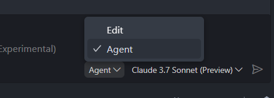
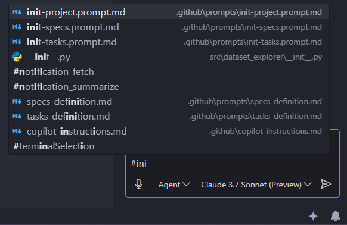
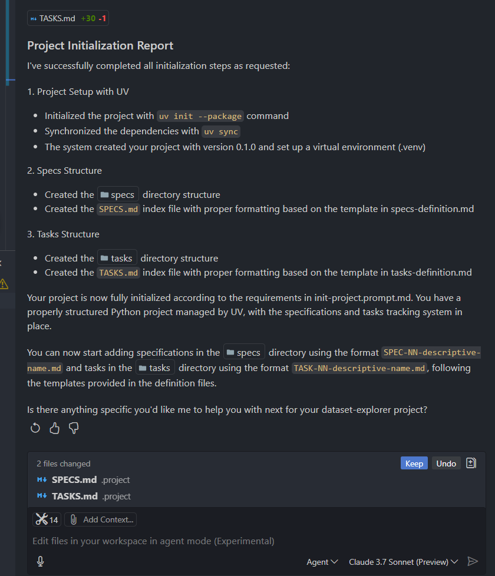
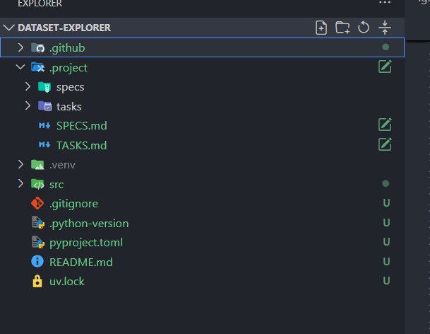

# Getting Started with Pilot Rules Copilot

This guide will walk you through setting up and using the Pilot Rules Copilot in VSCode.

## Prerequisites
- Visual Studio Code
- Terminal access

## Setup Instructions

### 1. Initial Setup
1. Open an empty folder in Visual Studio Code
2. In your terminal, run:
   ```bash
   uvx pilot-rules --copilot
   ```
   

### 2. Configure Copilot
1. Open Copilot in "Agents Mode"
2. Select Sonnet 3.7 as your model
   

### 3. Initialize Project
1. Begin typing "#init..." in the Copilot chat
2. Select the init-project rule from the suggestions
3. Send your selection
   

### 4. Project Generation
Copilot will automatically create the folder structure based on the defined rules.





### 5. Specs Generation
1. Begin typing "#init..." in the Copilot chat
2. Select the init-specs rule from the suggestions
3. Add your project description

For this example we are using following prompt:

```
create specs for following app:

A Python command-line interface (CLI) application that enables users to download, explore, and analyze datasets from Hugging Face. The application features a rich, elegant interface built with the Rich library and provides comprehensive dataset exploration capabilities. The application operates exclusively in interactive mode without command-line arguments.
```

---
*Note: Make sure to follow each step in order to properly set up your project with Pilot Rules Copilot.*

